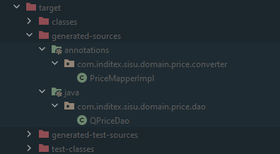
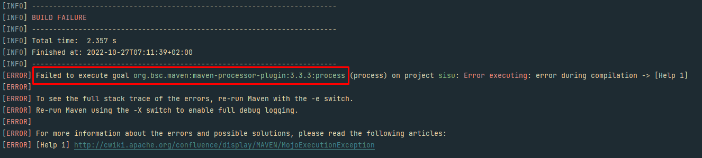
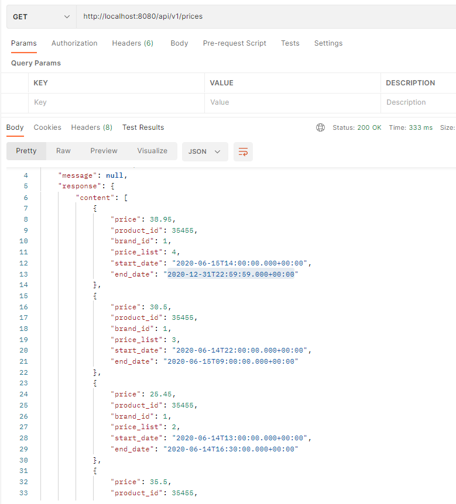

# Prueba Técnica Inditex (SISU) 

## ¿Que se va a usar?

Se ha pensado en usar los siguientes herramientas/librerias:

+ Java 11
+ Lombok
+ Mapstruct
+ H2
+ SpringBoot

Se consideró en usar MapStruct y Lombok por la sencillez que refleja en el código.
Por otra parte, la decisión de usar SpringBoot, Java 11 y H2 era por requerimiento de la prueba.

## ¿Como instalar el proyecto?

El proyecto una vez bajado de github deberan instalar las dependencias asignadas en el pom con el siguiente comando:
```mvn clean install```
Esto permitirá bajarse las dependencias del repositorio central de maven.

A continuación ejecutaremos el comando de compilación: ````mvn clean compile````
Es un comando muy necesario ya que mapstruct te compila la implementación de las interfaces definidas con el ``@Mapper`` además de las QEntities de querydsl.
 En la siguiente imagen se ve el ejemplo:


## Problemas encontrados
Los problemas encontrados han sido los siguientes:

1. Error entre las dependencias Querydsl, Mapstruct y Lombok:
Al compilar el proyecto el terminal lanza un error aunque el resultado lo genera correctamente:
 
2. Al realizar los tests el ``@Mock`` y el ``@InjectMock`` vienen como null. Este error ha sucedido al final del timeline y no he podido arreglarlo, faltaria un poco de investigacón.

# Funcionamiento:

El funcionamiento de la aplicación es correcto. Si lanza una petición GET a *http://localhost:8080http://localhost:8080/api/v1/prices*
con lo filtros definidos:
+ brandId
+ date
+ productId



Para ver la base de datos acceder a *http://localhost:8080/h2-console*
+ user: sa
+ password: admin


